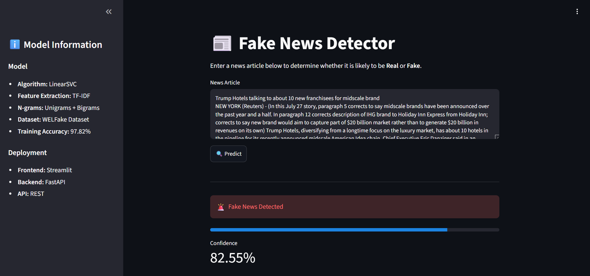

# 📰 Fake News Detector

An end-to-end **Fake News Detection** web application that classifies news articles as **Real** or **Fake** using a **Linear Support Vector Machine (LinearSVC)** trained on the **WELFake Dataset**. The application follows a production-style architecture with a **Streamlit frontend**, **FastAPI REST API backend**, and **Docker** containerization.

---

## 📸 Application Preview

> Replace this with your application screenshot.



---

## 🚀 Live Demo

**Frontend:** https://<your-streamlit-render-url>

**Backend API:** https://<your-fastapi-render-url>

**API Documentation:** https://<your-fastapi-render-url>/docs

---

## ✨ Features

- Detects whether a news article is **Real** or **Fake**
- Displays prediction confidence
- Interactive web interface built with Streamlit
- REST API powered by FastAPI
- Dockerized backend for easy deployment
- Automatic text preprocessing before inference
- Responsive and user-friendly interface

---

## 🏗️ System Architecture

```text
                 User
                   │
                   ▼
         Streamlit Frontend
                   │
          HTTP POST Request
                   │
                   ▼
        FastAPI REST API
                   │
          Text Preprocessing
                   │
          TF-IDF Vectorization
                   │
          LinearSVC Classifier
                   │
                   ▼
          Prediction Response
```

---

## 🧠 Machine Learning Pipeline

1. News article is submitted through the Streamlit interface.
2. Streamlit sends the article to the FastAPI backend.
3. The backend preprocesses the input text.
4. The cleaned text is transformed using the trained TF-IDF vectorizer.
5. The LinearSVC model predicts whether the news is Real or Fake.
6. The prediction and confidence score are returned to the frontend.

---

## 🛠️ Tech Stack

### Machine Learning

- Scikit-learn
- LinearSVC
- TF-IDF Vectorizer

### Backend

- FastAPI
- Uvicorn
- Pydantic

### Frontend

- Streamlit

### Deployment

- Docker
- Render

### Programming Language

- Python

---

## 📂 Project Structure

```text
FakeNewsDetector/
│
├── app.py                    # Streamlit frontend
├── api.py                    # FastAPI backend
├── utils.py                  # Text preprocessing
├── train_model.py            # Model training
├── svm_model.pkl             # Trained classifier
├── tfidf_vectorizer.pkl      # Saved TF-IDF vectorizer
├── requirements.txt
├── Dockerfile
├── .dockerignore
├── .gitignore
└── README.md
```

---

## ⚙️ Installation

Clone the repository

```bash
git clone https://github.com/<your-username>/fake-news-detector.git

cd fake-news-detector
```

Install dependencies

```bash
pip install -r requirements.txt
```

---

## ▶️ Run Locally

### Start the FastAPI backend

```bash
uvicorn api:app --reload
```

Open:

```
http://127.0.0.1:8000/docs
```

---

### Start the Streamlit frontend

```bash
streamlit run app.py
```

---

## 🐳 Run with Docker

Build the Docker image

```bash
docker build -t fake-news-api .
```

Run the container

```bash
docker run -p 8000:8000 fake-news-api
```

---

## 📊 Model Details

| Item | Value |
|------|------|
| Algorithm | Linear Support Vector Machine (LinearSVC) |
| Feature Extraction | TF-IDF |
| N-grams | Unigrams + Bigrams |
| Dataset | WELFake Dataset |
| Training Accuracy | **97.82%** |

---

## 🌐 Deployment

### Frontend

- Streamlit
- Hosted on Render

### Backend

- FastAPI
- Dockerized
- Hosted on Render

---

## 🔮 Future Improvements

- Replace TF-IDF with Transformer-based embeddings
- Add multilingual fake news detection
- Explain predictions using SHAP
- Improve confidence calibration
- Add batch prediction support
- CI/CD pipeline with GitHub Actions

---
